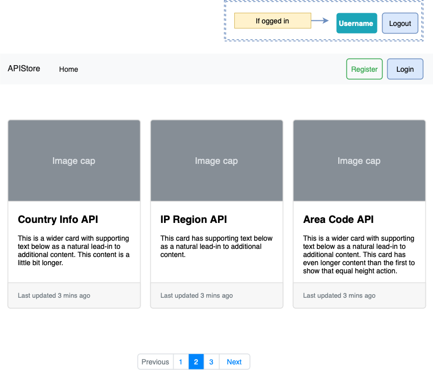
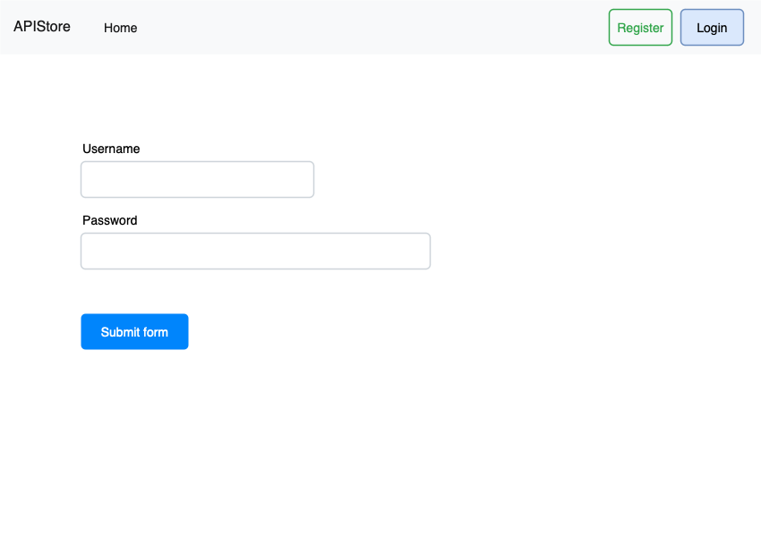

# The Project

It's time to build something amazing with Laravel.

Now modify the code in store-app directory to build a web application as shown in the following image.

🔔 If you have no idea about how to start, learn the following courses first:

<https://www.imooc.com/u/3781805>

## HomePage

### Requirements

- Set DB_CONNECTION to: sqlite

- Each user has a unique username

- Each product has a unique id

- Create database tables with Laravel Migrations: <https://laravel.com/docs/11.x/migrations>

- Fill some data with Laravel DB Seeder: <https://laravel.com/docs/11.x/seeding>

- Build the pagination part with: <https://laravel.com/docs/11.x/pagination>

- You should known the usage of the following commands

    - php artisan db:wipe

    - php artisan db:seed

    - php artisan migrate

    - php artisan migrate:fresh

    - php artisan migrate:refresh

- You should make the following commands:

    - php artisan product:create {name} -> to create a new product and store it to the database

    - php artisan user:create {name} -> to create a new user and store it to the database

    - php artisan product:delete {id}

    - php artisan user:delete {username}

    - php artisan user:rename {old} {new}

## Register Page

### Requirements

- Show error information if necessary

### Attentions

- What if the username has been registered by another user

- How to prevent someone from registering accounts unlimited times

## Login Page

### Requirements

- Show error information if necessary

### Attentions

- What if the user has already logged in

- How to prevent someone from unlimited attempts when he forget the password

## API Products

### What is API

### What is HTTP

## Summary

This is not an end.

Laravel works with many good friends in actual production environments.

And if you want to dive deeper into learning, don’t forget about them.

## Friends of Laravel

### AlpineJS

### Livewire

### TailwindCSS

TailwindCSS is a utility-first CSS framework.

Follow this link to make tailwindcss work with Laravel: <https://tailwindcss.com/docs/guides/laravel>

After that, you need to learn how to build beautiful web pages with tailwindcss and Laravel. Just practice within the store-app project.

## References

- <https://alpinejs.dev>
- <https://livewire.laravel.com>
- <https://tailwindcss.com>

## Next

Read the following articles to learn more:

[Expert.md](./Expert.md)
