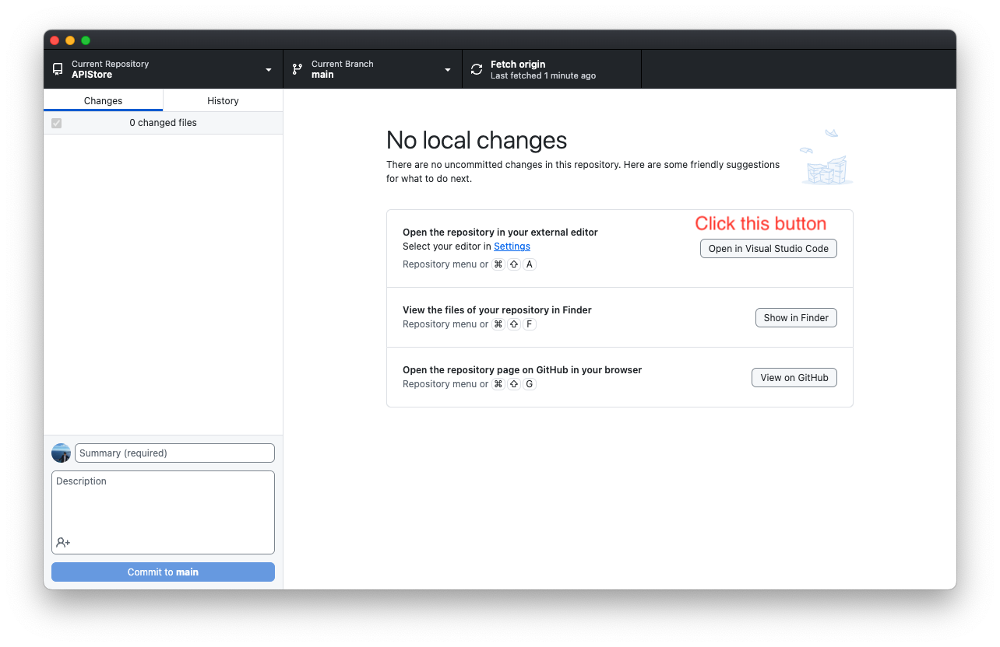

# APIStore

This project documents the entire process of me developing a website that sells APIs. It would be my great honor if it can help you.


## Before you start

All further operations will be performed on macOS because the author uses macOS.  

Users in mainland China may encounter many problems, please make sure that your network can smoothly access certain international websites. 

### Find an AI assistant

Do not do everything by yourself. Here are some great AI assistants:

- <https://sider.ai/download>
- <https://monica.im>

If you encounter any programming problems, try asking your AI assistant first.

### Say Hello to the Terminal App

Every macOS user has a Terminal app. It is the most powerful tool in our arsenal.

### Install Homebrew

What is Homebrew?

> Homebrew is a package manager for macOS (or Linux), which simplifies the installation of software like Git, Node.js, Python, and Ruby.

Simply put, it helps us install and manage software.

Please refer to <https://brew.sh> for more information.

### Install GIT

What is GIT?

> Git is a distributed version control system for tracking changes in source code during software development.

Simply put, it helps us manage code.

You can use the following command to install GIT:

```bash
brew install git
```

After installation is complete, enter this code in the terminal app and hit enter to run.

```bash
git --version
```

If you see the following output, congratulations! You have successfully installed GIT.

```bash
git version 2.34.0
```

### Install GitHub Desktop

What is GitHub Desktop?

> GitHub Desktop is a free and open-source graphical user interface for Git. It provides a visual representation of the workflow that occurs when using Git, including a timeline of commits, branches, and files

Simply put, it helps us manage code.

Please refer to <https://desktop.github.com> for more information.

After installation is complete, try to open this project with GitHub Desktop with the following steps:


### Install Visual Studio Code

What is Visual Studio Code?

Simply put, it helps us write code.

Please refer to <https://code.visualstudio.com> for more information.

After installation is complete, try to open this project with Visual Studio Code with the following steps:



Now, you can see all the code of this project.

### Install Node.js

A very useful software that many projects require, just install it!

You can use the following command to install Node.js:

```bash
brew install node
```

After installation is complete, enter this code in the terminal app and hit enter to run.

```bash
node -v
```

If you see the following output, congratulations! You have successfully installed Node.js.

```bash
v17.3.0
```

### Install PHP

We use PHP as the main programming language for developing websites.

You can use the following command to install PHP:

```bash
brew install php
```

After installation is complete, enter this code in the terminal app and hit enter to run.

```bash
php -v
```

If you see the following output, congratulations! You have successfully installed PHP.

```bash
PHP 8.1.0 (cli) (built: Sep 25 2021 16:37:49) (NTS)
Copyright (c) The PHP Group
......
```

## Submit a pull request

### What is a pull request?

A pull request is a way to suggest changes to someone else's project. 

This project is not yours, but if you want to submit some code, please initiate a pull request.

### How to submit a pull request?

1. Fork this project to your own GitHub account.
2. Clone this project to your local computer.
3. Create a new branch called "playground{random number}".
4. Create a new file called "playground.md".
5. Commit your code to the new branch.
6. Push the new branch to your GitHub account.
7. Click the "New pull request" button on your GitHub account and select the new branch you just pushed to create a pull request.

## What is API


## What is HTTP


## Say Hello to PHP

## Magical algorithm

### Reference material

- 《算法图解》
- 《大话数据结构》
- <https://leetcode.cn>

## Say Hello to TailwindCSS

### References

- <https://tailwindcss.com>

## Say Hello to Database

## Say Hello to Laravel

### References

- <https://laravel.com>
- <https://learnku.com/docs/laravel/10.x>

## Say Hello to JavaScript

### References

- <https://developer.mozilla.org/zh-CN/docs/Web>

## Say Hello to Linux

### References

- 《鸟哥的 Linux 私房菜》

## Become an Expert

### Say Hello to GitHub Actions

### Say Hello to Docker

### References

- 《大型网站技术架构：核心原理与案例分析》